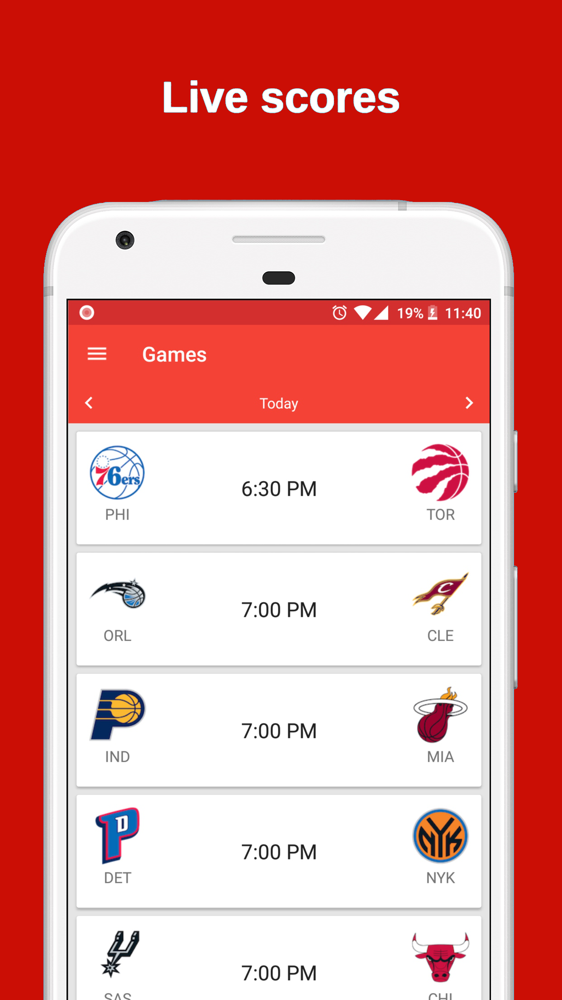
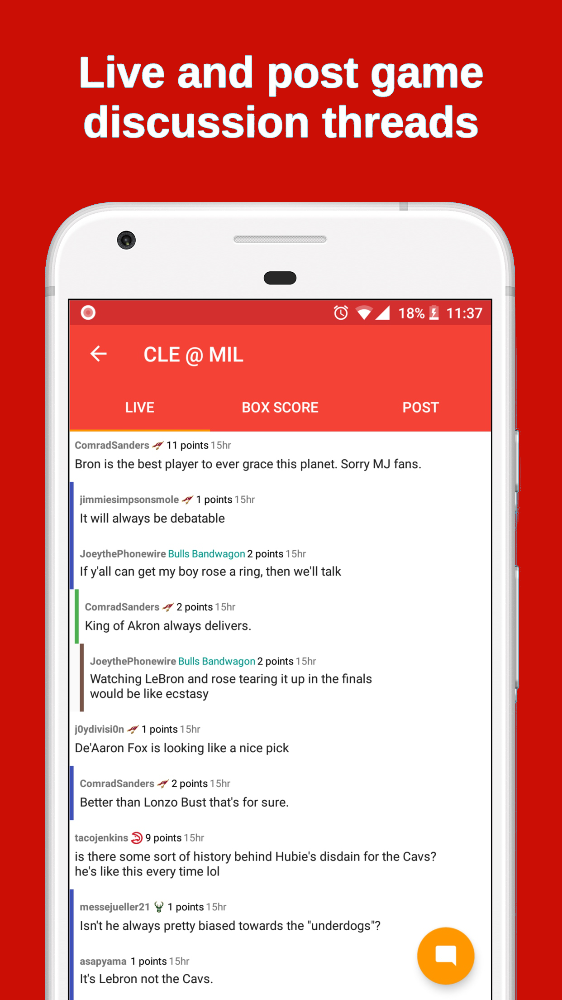
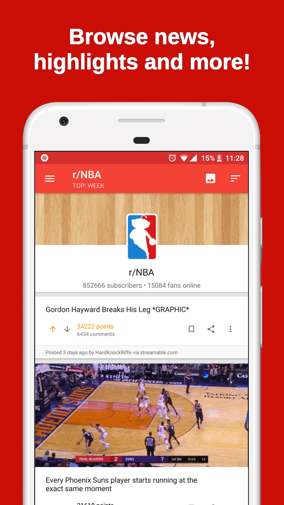
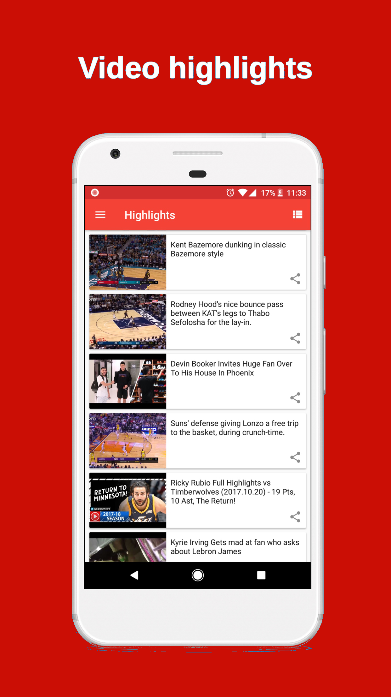
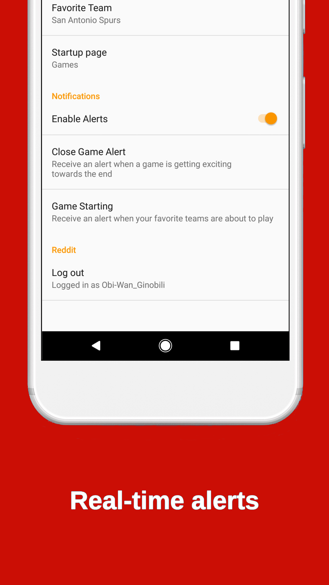

# Swish Android App

Android app for NBA fans. Features live scores, highlights, alerts and Reddit integration for discussions.

## Features
* Live scores and box scores
* [/r/NBA](https://www.reddit.com/r/nba) live and post game discussion threads
* [/r/NBA](https://www.reddit.com/r/nba) and all team subreddits threads
* Push notifications when games are close
* Push notifications when games begin/end
* User-submitted highlight videos
* Standings

## Screenshots
    

## Download

## Contributing  

Fix a bug, add a new feature or make the code prettier!

### Steps to contribute:
1. Fork the repository
2. Look at the list of [open issues](https://github.com/jorgegil96/All-NBA/issues), pick one or create a new one (this can be for a bug or wanted feature)
3. Write code and document it, look at the code around you and try to follow the style and conventions used.
4. Write unit tests (if possible)
5. Run ALL tests by executing `./gradlew test`
6. Send a pull request

Some resources and libraries that you might find useful:
* [JRAW](https://github.com/thatJavaNerd/JRAW): the Java Reddit API Wrapper, used throughout the application for integrating any reddit functionalities   
* [RxJava 2](https://realm.io/news/gotocph-jake-wharton-exploring-rxjava2-android/): A Java implementation of ReactiveX, a library for composing asynchronous and event-based programs by using observable sequences  
* [Retrofit 2](https://square.github.io/retrofit/): A contentViewType-safe HTTP client for Android and Java
* [Butter Knife](http://jakewharton.github.io/butterknife/): Field and method binding for Android views  
* [Picasso](http://square.github.io/picasso/): A powerful image downloading and caching library for Android

### What if I don't code?  

You can contribute by reporting bugs, suggesting new features or translating the app!
